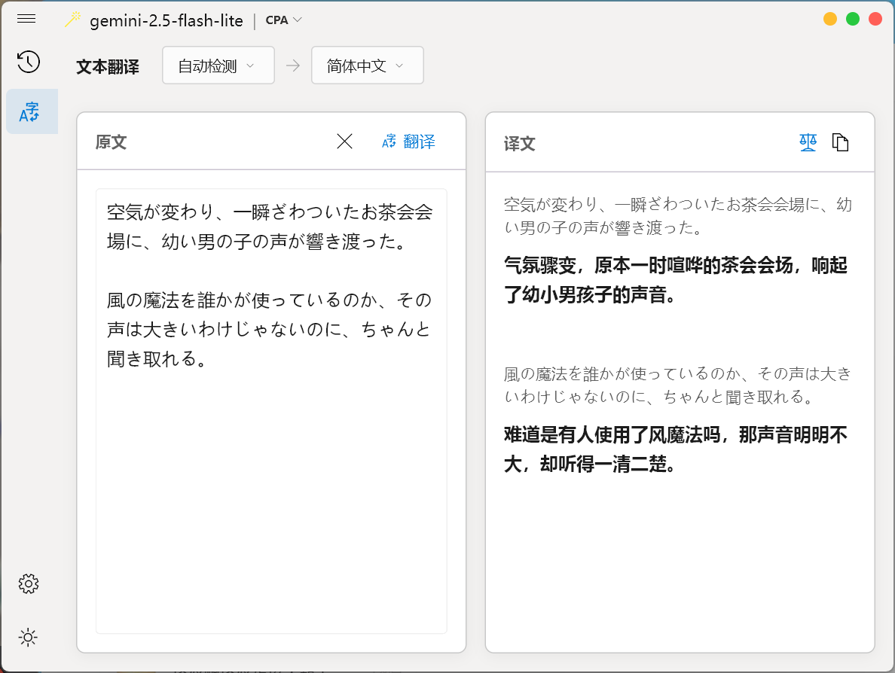
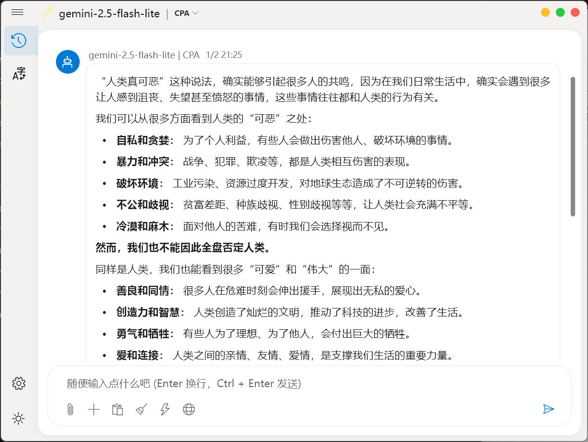

# Aurora

[中文](README_zh.md)

A cross-platform LLM chat client built with Flutter, supporting Windows and Android, designed with simplicity and fluidity in mind.

## Introduction

Aurora aims to provide a clean, native multi-platform experience.
*   **Windows**: Follows Fluent Design guidelines, supports Mica effects.
*   **Android**: Adapted for mobile interaction experience.

## Preview

<p align="center">
  
  
</p>
<p align="center">
  
  
</p>

## Features

*   **Interface**:
    *   **Windows**: Adopts Fluent UI, supports dark/light themes and Mica effects.
    *   **Mobile**: Adapted for touch operations and layout.
*   **Multi-model Support**: Supports OpenAI format API calls (including OpenAI, DeepSeek, Custom endpoints, etc.).
*   **Basic Conversation**: Supports multi-session management, local chat history storage.
*   **Content Rendering**: Supports Markdown rendering, including code block highlighting.
*   **Interaction**: Desktop supports shortcuts and drag-and-drop; Mobile supports basic gestures.

## Development & Build

This project is developed using Flutter.

### Requirements

*   Flutter SDK (3.0.0+)
*   **Windows**: Visual Studio (with C++ desktop development workload)
*   **Android**: Android Studio / Android SDK
*   Windows 10/11 (for building Windows version)

### Build Steps

1.  Clone repository:
    ```bash
    git clone https://github.com/huangusaki/Aurora.git
    cd Aurora
    ```

2.  Install dependencies:
    ```bash
    flutter pub get
    ```

3.  Generate code (Required):
    ```bash
    dart run build_runner build --delete-conflicting-outputs
    ```

4.  Run/Debug:

    *   **Windows**:
        ```bash
        flutter run -d windows
        ```
    *   **Android**:
        Ensure device is connected or emulator is running:
        ```bash
        flutter run -d android
        ```

## Configuration

Please configure the API provider on the settings page upon first run.

*   **API Key**: Enter the API Key for the corresponding service.
*   **Base URL**: 
    *   Any service compatible with OpenAI interfaces can be used.

---

## License

MIT License
