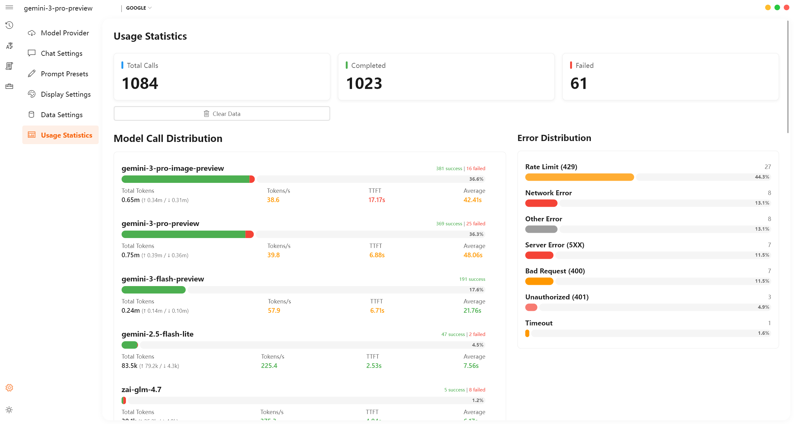
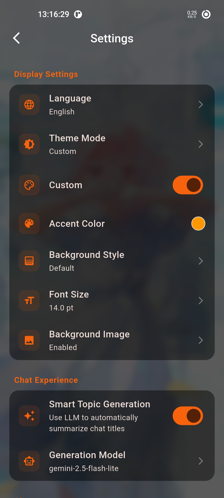

<div align="center">
  
  <h1>Aurora</h1>
  <p>基于 Flutter 的跨平台 AI 客户端</p>
  <a href="README.md">English</a>
</div>

## 预览

<p align="center">
  
  <span>&nbsp;&nbsp;&nbsp;&nbsp;</span>
  
</p>
<p align="center">
  
  <span>&nbsp;&nbsp;&nbsp;&nbsp;</span>
  
</p>

## 项目定位

本地优先的跨平台 AI 客户端，聊天、MCP、Skills、知识库、翻译、同步集成在一个应用内。

- 多 Provider、多协议路由，支持多模型组合使用。
- 核心数据默认存储在本地。

## 平台支持

| 平台 | 状态 | 说明 |
| --- | --- | --- |
| Windows | ✅ | 桌面主力平台，Fluent 风格、窗口管理、托盘、桌面 Skills。 |
| macOS | ✅ | 桌面端完整功能，原生布局适配。 |
| Linux | ✅ | 桌面端完整功能。 |
| Android | ✅ | 移动端适配，含附件与 Bottom Sheet 交互。 |
| iOS | ✅ | 移动端适配，含附件与 Bottom Sheet 交互。 |

## 已实现功能

### 1. 聊天与会话管理

- 本地持久化聊天记录、会话树、主题、Token 统计与附件引用。
- 树状历史，可搜索、重命名、删除、拖拽排序、分支会话。
- 流式输出、思考/推理展示、消息重试、编辑与删除。
- 输入区 `@` 切换模型、`/` 切换预设。
- Markdown、代码块、表格、图片、脚注、LaTeX 公式渲染。
- 消息气泡展示 TTFT、TPS、Token 用量、时间戳、工具输出。

### 2. 多 Provider 与模型路由

- 内置 OpenAI 与自定义 Provider，兼容 OpenAI API、Gemini Native、Anthropic Messages。
- 模型列表拉取、按能力路由、Provider / 模型启停与排序。
- 多 API Key 轮询、请求超时、全局 / 模型级参数配置。
- 按能力分别指定聊天、Embeddings、图片、语音、转录、翻译所用模型。

### 3. 助手系统

- 多助手，各自配置头像、名称、描述、系统提示词。
- 每个助手可绑定独立 Skills、MCP 服务器、知识库。
- 助手级长期记忆，可指定记忆提炼所用 Provider / Model 或跟随当前聊天模型。
- 记忆自动提炼用户偏好（语言、篇幅、格式、语气、代码风格等）。

### 4. MCP 与工具调用

- 传输方式：`stdio`、`streamable HTTP`。
- 连接测试、状态查看、重连、延迟显示、工具缓存、错误输出。
- 全局、会话、助手三级绑定。
- 聊天中可将 MCP 工具直接暴露给模型调用。

> `stdio` 目前仅桌面端可用；移动端仅暴露 HTTP 类型 MCP 服务器。

### 5. Skills 插件

- 读取 `skills/` 下的 `SKILL.md` / `SKILL_<lang>.md`，将本地技能声明为可调用工具。
- 工具类型：shell、HTTP、API。
- 模型可根据技能手册自动选择并执行。
- 适合将固定流程封装为可复用插件。

> shell 型 Skills 仅限桌面端。

### 6. 知识库（RAG）

- 创建本地知识库，导入文件后分块检索。
- 词法检索 + 可选 Embeddings 检索。
- 检索结果注入上下文，可由模型改写检索 query。
- 助手可绑定独立知识库。

### 7. 联网搜索与翻译

- 内置联网搜索，搜索结果回注对话后生成回答。
- 搜索可配置引擎、地区、安全搜索、结果数、超时。
- 独立翻译页，语言自动检测、双栏对照、一键复制。

### 8. 多模态能力

- 图片、音频、视频、文件附件输入。
- 配合对应模型可实现图像理解、音频转录、翻译、图片生成等。

> 实际可用能力取决于 Provider、模型与路由配置。

### 9. 界面、设置与运维

- 中英双语、浅色 / 深色 / 自定义主题、强调色、背景图、模糊与亮度调节。
- 桌面端托盘、窗口关闭行为配置、最近会话恢复。
- Prompt 预设，可插入 `{time}`、`{user_name}`、`{system}`、`{device}`、`{language}`、`{clipboard}` 等变量。
- 内置日志查看、错误记录、调用统计、模型能力实验页。

### 10. 同步与备份

- WebDAV 远程备份、恢复与管理。
- 本地导出 / 导入。
- 备份范围可选：聊天记录、预设、Provider 配置、应用设置、助手、知识库、使用统计。

## 项目结构

```text
lib/
  core/        基础设施、启动与通用能力
  features/    聊天、助手、MCP、知识库、同步等功能模块
  l10n/        国际化资源
  shared/      共享服务、主题、组件与工具
packages/
  aurora_search/  搜索能力封装
skills/
  Skills 示例与扩展入口
```

## 当前限制与说明

- shell Skills 和 `stdio` MCP 仅限桌面端；移动端以 HTTP MCP 为主。
- 多模态能力（图片、语音、转录、翻译）取决于所选模型实际支持情况。

## License

MIT License
